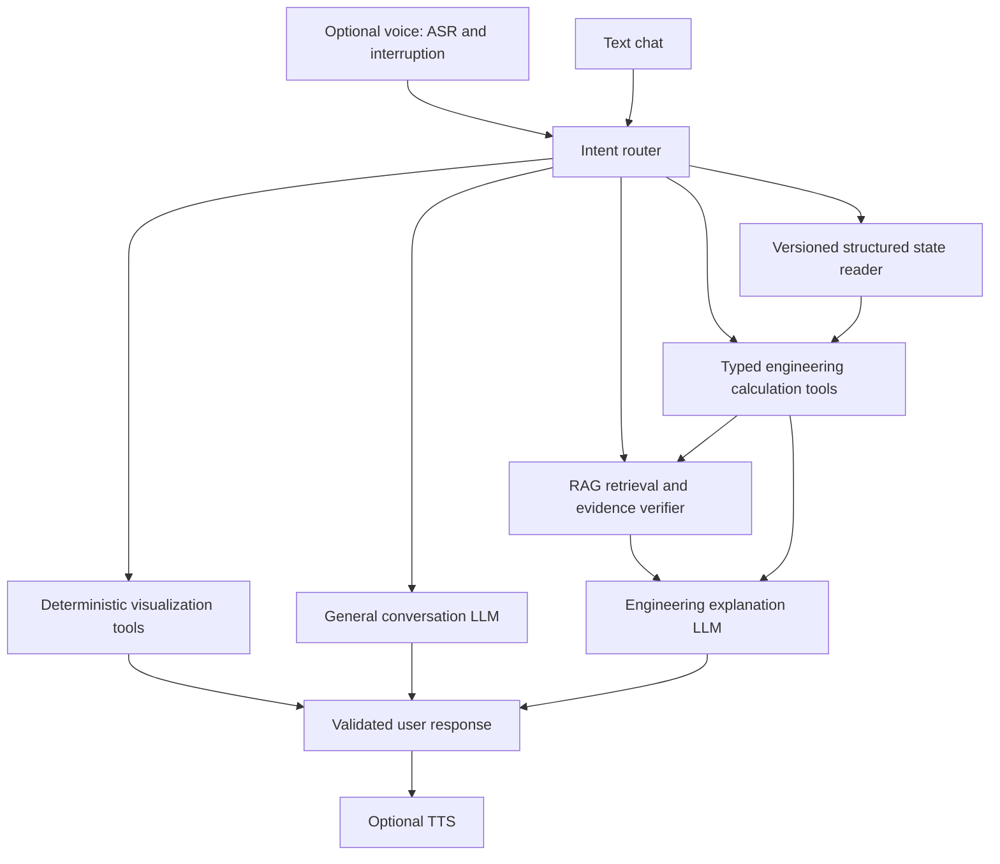

# Engineering assistant QA and stabilization report

Date: 2026-10-01. The repository and the local Ollama service were inspected.
This report separates executable evidence from capabilities that the software
does not have. The original architecture map and test plan were written before
code changes in [assistant_qa_plan.md](assistant_qa_plan.md).

## A. Architecture and model routing

`TorqueSpeedApp` is a single CustomTkinter process composed of simulation
mixins. `AssistantMixin` owns a sidebar, a conversation list per app instance,
and a background worker. The worker calls `rag_store` (Chroma + Ollama
embeddings) and `llm_client` (local HTTP at `localhost:11434`). Tk receives
worker results through a queue. There is **no voice, microphone, speaker,
speech-to-text, vision, screenshot, agent framework, tool-call loop, or
assistant-controlled simulation/edit/plot interface** in this repository.

| Role | Actual model/path | Selection and prompt |
|---|---|---|
| General text, engineering explanation, app-state explanation, RAG synthesis, and conversational follow-up | `qwen3:4b-instruct` by default; user may select any installed Ollama chat model | One `SYSTEM_PROMPT` + `APP_GUIDE` + analysis-type list for all model requests. No specialized prompts or separate reasoning/vision model. |
| Checked common arithmetic, greetings, exact state reads, evidence guards | Python | No model call. |
| Document and query embeddings | `nomic-embed-text` | CPU for queries, GPU allowed during index rebuild. No chat prompt. |
| Voice, tool/function calling, summarization | None | Not implemented. Chat history is truncated, not summarized. |

The sidebar now routes `local`, `state`, `rag`, `model`, `state_action`, and
`plot_action` intents. The last two explicitly state that chat cannot perform
those actions. The selected chat model is used for the three model-backed
routes; there is no evidence supporting a multi-model router. The fixed Ollama
context is 4096 tokens for every selected model. Message assembly now has an
approximate 10,000-character prompt ceiling, but it does not query a selected
model's true tokenizer or context limit. A source excerpt can therefore be
cut; that limitation is reported below.

| Intent | Current route/model | Actual operation |
|---|---|---|
| Greeting or checked arithmetic | `local` / Python | No model or retrieval; deterministic text or calculation. |
| General or motor explanation | `model` / selected chat model, except checked concepts | Text generation only. |
| Current screen/result question | `state` / checked read or selected chat model | Fresh structured UI snapshot; no pixels or direct edit. |
| Document/standard question | `rag` / retrieval then selected chat model or checked evidence reply | Chroma query, source-ID validation; no standards database beyond indexed files. |
| Calculation without complete supported inputs | `calculation_request` / Python | Explicitly requests needed inputs or directs to app analysis. |
| Parameter edit, simulation run, or plot request | `state_action` or `plot_action` / Python | Honest unavailable-action reply; no state mutation or plot creation. |
| Voice or multi-tool workflow | No route | No audio stack or function-call protocol exists. |

### Actual assistant operations and schemas

These are Python calls, **not** LLM function tools. Except for index rebuild
and chat logging, they do not mutate simulation state.

| Operation | Input → output | State / files / UI / plots | Execution and error path |
|---|---|---|---|
| `plan_request` | `(question: str, history: list[role,content]) → {route,model,operations}` | No state, file or plot access | Synchronous, pure policy. |
| `small_talk_reply`, `checked_calculation_reply` | `str → str` | Narrow deterministic conversation and shaft power, gearing, grade force, range arithmetic; no app state | Synchronous. Invalid or incomplete inputs return empty, then another route handles them. |
| `_screen_snapshot` | No input → `{analysis,inputs,selectors,datasets,results,plots}` | Reads Tk entries, selected controls, presence of loaded data, computed observations and sampled Matplotlib lines; no screenshot or plot generation | Synchronous on Tk thread. Widget reads are guarded; section-specific computations can fail soft. |
| `read_state_reply` | `(question, snapshot) → str` | Reads selected exact numeric inputs, top-speed and startable-gradient observations | Synchronous. Invalid values are reported; grade comparisons use only the computed startable result. |
| `rag_store.query` | `(question, top_k=3, max_distance=0.33) → [{text,source}]` | Reads local Chroma index; embeds via Ollama; no app mutation | Synchronous inside worker. Exceptions produce an unavailable-search answer. |
| `checked_document_reply`, `document_evidence_limit`, `ground_rag_reply` | `(question,hits)` or `(reply,hits,question) → str` | Checks explicit ratings, missing/conflicting sources, and citation identifiers | Synchronous. A missing valid citation yields a short cited excerpt instead of model prose. Semantic truth of arbitrary cited prose remains unverified. |
| `build_messages` | `(question,screen,hits,history,analysis_types) → list[{role,content}]` | Assembles prompt; document history omits previous assistant claims | Synchronous, approximate context budget. |
| `llm_client.stream_chat` | `(messages,model,max_tokens,on_chunk) → (text,metrics)` | Local Ollama HTTP; no app state or files | Synchronous network call inside worker. It rejects tool-call events, empty/incomplete responses and HTTP failures. UI buffers chunks before display. |
| `rag_store.rebuild_index` | `(progress callback) → (files,chunks,warnings)` | Reads supported files under `knowledge_base/`, writes Chroma and manifest; never changes simulation inputs | Worker thread. Per-file extraction errors become warnings. |
| `_log_chat_exchange` | `(question,answer,status,metrics) → JSONL row` | Writes local `assistant_chat_log.jsonl` with session ID, route, trace, model and timing | Worker thread; write errors are suppressed so chat remains available. Log rows are not rendered as chat. |

The application itself has many deterministic simulation and plot functions
(`parametric`, `torque_force`, `efficiency`, `drive_cycle`, `range_analysis`,
`mtpa_mtpv`, `mechanical_design`, `bom`, and `dispatch`). **None is exposed as
an assistant tool.** No tool parameter schema, transactional UI edit, plot
artifact return, or multi-tool chaining exists. Requests that require those
are target capability gaps, not successful tool calls.

### State visibility

| State requested | What the model can receive when “Use current analysis” is on |
|---|---|
| Vehicle mass, wheel radius, gear ratio/efficiency, gradient text and unit, Crr/CdA, motor torque/power, battery voltage/current and fallback efficiency, thermal-point text | Live core widget values in structured snapshot fields. Closed sections do not hide the core values. |
| Top speed, gradeability, acceleration | App-computed observations for analyses that produce them. A direct flat-road top-speed read uses that observation. |
| Drive cycle, efficiency maps, range, operating points | Loaded/not-loaded flags and some analysis-specific result text. No full trace, map grid, per-point table, or range calculation table is sent. |
| Plots | Up to three axes and five labeled line series per axis, each summarized with six samples and a peak. Contours, heatmaps, images, scatter collections, and full arrays are not represented. The displayed plot may predate edits. |
| Wheelbase, CG height | No such input widgets were found in the main app; the snapshot only includes them if future widgets are added. |
| Screenshot or physical sensor readings | None. |

There is one conversation list per app instance, retained for the last six
messages. New Chat clears it and rotates the log session ID. There are no
separate voice/RAG/screen agents to mix histories. RAG messages exclude
previous assistant replies as evidence, but previous user turns still provide
follow-up context. Model answers and app state are not stored as a durable,
versioned engineering state; edits made directly in the UI require a fresh
snapshot, and plotted lines may remain stale until Update Plot.

## B. Test suite and questionnaire

The complete [406-case questionnaire](../tests/assistant_qa_cases.json) is
generated by [generate_assistant_qa_cases.py](../tools/generate_assistant_qa_cases.py).
It covers general conversation, vehicle calculations, motor analysis, screen
analysis, RAG, tool selection, parameter state, plots, voice transcript
behavior, invalid inputs, unknown information, ambiguity, 30 multi-turn
conversations, and 20 topic switches. Each row has an ID, category, input,
history, expected behavior, target tools, expected parameters, output
properties, and evaluation type. Target tool names describe the desired
future architecture; the current program does not execute them.

[assistant_qa.py](../tools/assistant_qa.py) checks 124 deterministic route
expectations without comparing natural-language strings. It writes one JSONL
row per case with status, reason, model, operations and latency. Other cases
are explicitly `unverified`. [assistant_rag_probe.py](../tools/assistant_rag_probe.py)
separately checks retrieval for all 40 RAG questions, with 10 known source or
known absence assertions. [test_assistant_stabilization.py](../tests/test_assistant_stabilization.py)
tests grounding guards, exact state reads, arithmetic, context isolation,
source metadata, missing evidence, tool-call rejection and index maintenance.
The original pytest suite still checks physics and plotting functions.

## C. Results

| Run | Total | Passed | Failed | Unverified / excluded |
|---|---:|---:|---:|---:|
| Original repository pytest in sandbox | 239 | 238 | 1 environment-only Tk failure | 0 |
| 406-case routing corpus before fixes | 406 | 8 | 116 | 282 semantic, GUI, voice or live-model checks |
| 406-case routing corpus after fixes | 406 | 124 | 0 | 282 semantic, GUI, voice or live-model checks |
| 40-question retrieval probe after index rebuild | 40 | 10 | 0 | 30 need source-level semantic review |
| Full pytest suite after fixes, with Windows GUI access | 408 | 408 | 0 | 0 |
| Final 41-case live questionnaire, rule-based checks | 41 | 41 | 0 | 0 under its limited rubric |

The corpus also identifies **96 cases whose target tool sequence includes a
generic capability not implemented by the assistant**, mainly parameter edits,
plot generation, arbitrary engineering calculations and speech. Passing a
route check does not mean the target tool action happened. The initial Tk
failure came from the sandboxed portable Python runtime, not the application;
the GUI smoke test and full suite passed with Windows display access.

The final live questionnaire includes 41 existing conversational, engineering,
document, and screen cases using the installed local model. Its JSONL output is
kept in the ignored `reports/` directory because generated RAG answers may
contain excerpts from local standards and product documents. All 41 met the
limited rubric; style checks found no leaks. Seven expected document sources
were retrieved in seven checked cases. Median total latency was effectively
zero for local replies and the 90th percentile was 9.0 seconds across all 41
cases. These checks catch missing expected facts and obvious style leaks;
they do not establish semantic or numerical validity for every answer.
Earlier answers that scored 1.00 still contained wrong engineering claims,
which were corrected only after manual review.

The focused Ollama run used `qwen3:4b-instruct` on eight existing benchmark
cases. Four required model generation: median first content was 12.45 s,
median total model time 17.69 s; the first measured load was 8.98 s. Local
greeting and shaft-power replies took effectively zero model time. The RAG
probe's median retrieval latency was about 0.05 s over 40 questions. At idle,
Ollama `/api/ps` listed no loaded model, so a reliable peak RAM/VRAM figure
was not captured. Live voice latency was not measured because no voice path
exists.

Live answers exposed two meaningful defects: uncited U546/testing summaries
and an unsupported safety assertion in a cited continuous-torque answer.
The current path replaces uncited summaries with cited excerpts and handles
the explicit continuous-rating and conflicting-current fixtures in code. A
follow-up run confirmed the two checked document cases return immediately
with both source identifiers where needed. This is a focused regression, not
a claim that all 406 natural-language cases have been semantically graded.

A later 41-case live review found engineering-answer failures that simple
keyword rubrics missed: a wrong kW torque-speed equation, a BLDC rotor
description that omitted its permanent magnets, an unconditional preference
for PM over induction, and a claim that the battery limit cannot affect top
speed. Narrow checked explanations now use correct units, describe design
tradeoffs, and follow the app's actual battery-cap and force-crossing logic.

## D. Root causes, changes, and priorities

| Priority / category | Symptom and evidence | Root cause | Fix / remaining limit |
|---|---|---|---|
| Critical / tool-selection, state management | “Change mass” and “Plot torque” previously went to the model, which had no edit or plot API. The baseline corpus failed these routes. | Single fallback path treated every nonlocal request as answerable text. | Explicit action routes give truthful responses. Real edit/plot tool interfaces remain to be built. |
| Critical / RAG grounding, hallucination | The live U546 and mechanical-test runs produced no exact source ID; a fixture answer claimed no more data was needed. | Prompt-only citation policy, no verifier. | Exact source-ID check, sourced excerpt fallback, deterministic narrow rating comparisons, conflict detection, missing-source guards. Arbitrary cited claims still need review. |
| Major / retrieval | Similarity search sometimes put a mechanical-design paragraph ahead of a testing procedure or the U546 efficiency file behind a torque file. | Top-three vector order and filename shortcut lacked task-sensitive reranking. | Retrieve a larger candidate set and rerank by distinctive terms/source type. Ten known retrieval checks pass; 30 queries remain semantically ungraded. |
| Major / stale RAG data | A changed file that became a duplicate could leave its old chunks in Chroma. | Duplicate branch skipped without deleting prior IDs. | Delete old IDs and manifest entry; regression test added. PDF chunks now retain page IDs (`INDEX_VERSION=4`). |
| Major / context and memory | Document replies could inherit old assistant claims; 3 long excerpts plus six turns could exceed the fixed context. | History included assistant prose as if evidence; no request budget. | RAG excludes prior assistant turns; approximate prompt budget limits content. Tokenizer-accurate model-specific budgeting remains open. |
| Major / UI integration, streaming | Raw partial model content and model/tok-s debug metadata could appear in chat. | Streaming chunks rendered before validation; metrics were appended as chat rows. | Buffer and validate final text, reject tool-call events and structured/internal payloads, keep trace in JSONL. Full GUI smoke test passes. |
| Major / state access | Collapsed core fields were omitted from snapshots; “current” electrical current could trigger screen context. | Visibility-only widget filter and broad keyword routing. | Core inputs captured regardless of collapsed section; intent pattern distinguishes present app state from electrical current. Exact reads use live values. |
| Major / state grounding | A 20% climb question could elicit an unsupported projected number, which the numeric guard withheld despite a 19.4% app result. | No checked comparison for the existing startable-gradient observation. | A deterministic read now compares the requested grade with the current peak-curve startable result and states that sustained climbing still needs traction and thermal checks. |
| Major / numerical and motor explanation | The live model wrote a kW torque-speed equation without the /1000 conversion, described a BLDC rotor as electromagnetic, and treated one motor type as universally better. | Generic model prose was used for stable engineering definitions and a design choice without candidate data. | Checked replies now use the correct power equation, describe PMSM/BLDC terminology carefully, and require candidate duty and map evidence for selection. A fully specified torque-constant calculation is deterministic. Open-ended model explanations still need review. |
| Major / app-model explanation | A live answer claimed battery power could not limit top speed and treated the DC limit as a generic safety guarantee. | The model described a general formula without reading the app's actual cap and top-speed routines. | Checked app-specific replies use `battery_power_cap_w` semantics and the first net-force crossing; they state when the cap is inactive and avoid claiming battery safety. |
| Minor / performance | Every nonlocal message called RAG and could warm the embedding model. | No distinct document intent. | RAG only for document/test intent; narrow document comparisons avoid model calls. |

The structured chat log now records `USER → ROUTER → TOOL_CALL/TOOL_RESULT →
MODEL → FINAL_RESPONSE` events, session ID, model, timing, route, source IDs,
token metrics when supplied by Ollama, input shape and error status. Logs stay
off the chat display. The whole raw prompt and confidential document text are
not duplicated into the trace.

## E. Remaining issues and recommended architecture

1. **No assistant-driven edits, simulations or plots.** Building these needs
   typed tool schemas, unit validation, a UI-thread command boundary, a
   versioned state snapshot, and post-action verification against the widget
   and computed result. Until then, the assistant explicitly declines actions.
2. **No voice pipeline.** Microphone, ASR, TTS, interruption, partial-speech,
   latency and turn-taking tests are in the questionnaire but cannot be run on
   this repository. Do not claim a voice model exists here.
3. **RAG semantic grounding is partial.** An exact citation proves the ID was
   retrieved, not that the sentence follows from it. DOCX sources have chunk
   IDs but no page/section metadata. A standards decision still requires
   inspecting the original document.
4. **State coverage is partial.** Heatmaps, tables, complete drive-cycle and
   efficiency-map arrays are not in the snapshot. Plot samples may be stale.
5. **Model context is approximate.** The fixed 4096-token Ollama setting and
   character budget may drop useful context for long documents or histories.
6. **Semantic coverage remains open.** 282 questionnaire cases need model,
   GUI, plot, numerical or voice review beyond route checks. The 30 retrieval
   queries without a known oracle must be judged against the source files.

Recommended boundary for a future implementation:



Do not route audio to a heavy engineering model for greetings. Keep numerical
state in the app, pass a versioned copy into tools, execute edits and plots on
the Tk thread, and return explicit artifacts/results. The language model
should explain deterministic tool results and synthesize cited evidence,
without being the source of the numerical result.

## F. Regressions and manual procedure

Run from the repository root with its pinned environment:

```powershell
$py = '.venv\Scripts\python.exe'
& $py tools/generate_assistant_qa_cases.py
& $py tools/assistant_qa.py --legacy --output reports/assistant_qa_before.jsonl
& $py tools/assistant_qa.py --output reports/assistant_qa_after.jsonl
& $py tools/assistant_rag_probe.py --output reports/assistant_rag_probe.jsonl
$env:TCL_LIBRARY = Join-Path (Get-Location) '.uv-python\cpython-3.11-windows-x86_64-none\tcl\tcl8.6'
$env:TK_LIBRARY = Join-Path (Get-Location) '.uv-python\cpython-3.11-windows-x86_64-none\tcl\tk8.6'
& $py -m pytest -q
& $py tools/questionnaire.py --models qwen3:4b-instruct --output reports/questionnaire_live.jsonl
& $py tools/benchmark_assistant.py --models qwen3:4b-instruct --cases greeting power real_top_speed real_u546 real_mech_tests document conflict tses --output reports/assistant_live.jsonl
```

Rebuild the knowledge base after changing extraction or adding files:
`& $py -c "from vmi import rag_store; print(rag_store.rebuild_index())"`
(Ollama and the embedding model must be running). For live GUI review, open
the assistant, verify short casual turns, read a changed mass from the UI,
press Update Plot before asking about axes, check a missing TSI answer, inspect
the source ID on a PDF answer, request an unsupported plot/edit, and verify
no JSON or debug trace appears in chat. For every analysis plot, use the app's
own plot controls and verify axes, units, curves, maps and exported data
against the input state; chat does not generate those plots. Voice review
starts only after an audio implementation is added.
